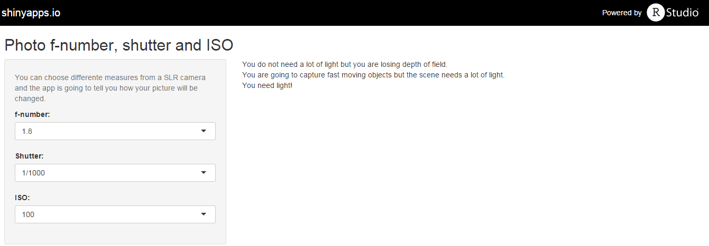

## Introduction

In photography, you have three controls in your camera:

1. Diaphragm.
2. Shutter speed.
3. ISO sensitivity.

--- .class #id 

## Diaphgram

The diaphragm is measured by the f-number.

The f-number represents how open is the diaphragm and how much light will
go through the lens.

As the number increases, the quantity of entering light decreases and the depth 
field also decreases.

```{r opts.label = 'interactive', results = 'asis', echo=FALSE}
library(googleVis)
mes <- c("Light","Depth")
val <- c(60,40)
response <- data.frame(mes, val)
pie <- gvisPieChart(
        response, 
        options = list(
                    title = "4f",
                    pieHole=0.5,
                    height = 100))
print(pie, tag = 'chart')

val <- c(50,50)
response <- data.frame(mes, val)
pie <- gvisPieChart(
        response, 
        options = list(
                    title = "5.6f",
                    pieHole = 0.5,
                    height = 100))
print(pie, tag = 'chart')

val <- c(40,60)
response <- data.frame(mes, val)
pie <- gvisPieChart(
        response, 
        options = list(
                    title = "8f",
                    pieHole=0.5,
                    height = 100))
print(pie, tag = 'chart')
```

--- .class #id 

## Shutter speed

The shutter speed is how long the camera will let the light go through the lens.

As long as the shutter is open, more light will pass. But the camera has to
be in an stable tripod or the picture will bu blurred. 

When the shutter opens and closes fast, less light will pass but the
moving objects will be captured in the image.

```{r opts.label = 'interactive', results = 'asis', echo=FALSE}
library(googleVis)
mes <- c("Light","Movement")
val <- c(70,30)
response <- data.frame(mes, val)
pie <- gvisPieChart(
        response, 
        options = list(
                    title = "1/15",
                    pieHole=0.5,
                    height = 100))
print(pie, tag = 'chart')

val <- c(50,50)
response <- data.frame(mes, val)
pie <- gvisPieChart(
        response, 
        options = list(
                    title = "1/60",
                    pieHole = 0.5,
                    height = 100))
print(pie, tag = 'chart')

val <- c(30,70)
response <- data.frame(mes, val)
pie <- gvisPieChart(
        response, 
        options = list(
                    title = "1/1000",
                    pieHole=0.5,
                    height = 100))
print(pie, tag = 'chart')
```

--- .class #id 

## ISO sensitivity

When the cameras needed film, the sensitivity the film was determined by
the ISO measure. 

Greater the ISO measure, greater the sensitivity to light. But with this,
the picture gain more grain.

```{r opts.label = 'interactive', results = 'asis', echo=FALSE}
library(googleVis)
iso <- c("ISO100","ISO200","ISO400")
val <- c(50,60,70)
response <- data.frame(iso, val)
gauge <- gvisGauge(
        response, 
        options=list(
                min=0, max=100, 
                greenFrom=0,
                greenTo=100,
                height=100))
print(gauge, tag = 'chart')
```

--- .class #id 

## Application

The app will tell you how changing parameters will affect your photography.

You can change the parameters with the most commons levels.

